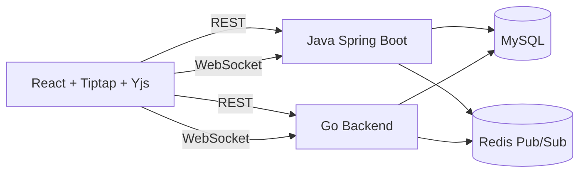

# Architecture

The frontend is backend-agnostic. It talks to either backend through the same REST API and WebSocket message contract.

Yjs is the source of truth for collaborative rich-text state. Backends authenticate users, authorize documents, persist Yjs updates in MySQL, and fan out updates through Redis.

To keep long-lived documents from replaying an unbounded update sequence, both backends support Yjs state snapshots. A snapshot stores a compact state update plus the highest persisted sequence it covers; `sync:init` sends the latest snapshot first and then only later incremental updates.

## High-Concurrency Collaboration Path

The current high-concurrency design targets hotspot collaborative documents while keeping the REST and WebSocket contract stable across Java and Go. It is a compatibility-first design: MySQL remains the durable source of truth, Redis remains the cross-instance real-time bus, and the frontend can still switch between the Java and Go backends without backend-specific UI behavior.

Client-side write pressure is reduced before it reaches the backend. Local Yjs updates are merged in a short flush window before they are sent over WebSocket, and the frontend checks `socket.bufferedAmount` before sending non-critical realtime messages. Remote Yjs updates are still applied normally and are not echoed back as local writes.

On the backend, each WebSocket connection has an outbound queue and an independent writer. Broadcast code only enqueues serialized messages; it does not synchronously write to every socket. If a client cannot drain its queue, the backend emits `SLOW_CLIENT` metrics and closes that connection so one slow browser does not block other collaborators on the same document. Java also serializes all established-session writes through the same outbound writer path, including `sync:init` and slow-client errors, to avoid concurrent writes to the same Tomcat WebSocket session.

`sync:update` persistence is batched by document. A short-cycle update batcher groups concurrent updates for the same document, appends them in one MySQL transaction, assigns contiguous sequence numbers, and broadcasts only after the durable write succeeds. The `document_sequences` table tracks the next sequence per document so the write path does not need to scan `MAX(seq)` for every update. Document `updated_at` writes are also bounded by a time window to reduce write amplification on hotspot documents.

Snapshot submission is guarded on the server. An editor can still send `sync:snapshot`, but the backend accepts it only when the snapshot is based on the latest persisted sequence and compacts enough incremental updates. This prevents many active editors from repeatedly submitting stale or low-value snapshots during heavy editing.

The design improves the common "many people watching, some people editing" case. It does not make a single document infinitely scalable: every update or presence message still fans out to the active connections for that document. High-frequency `presence:update` from every connected user is therefore more expensive than realistic edit traffic because it approaches `clients * clients` message delivery.

Productized collaboration features build on the same contract:

- Document lists support title search and active/deleted filtering.
- Soft-deleted documents remain recoverable by owners.
- Versions store the server-persisted Yjs update sequence at save time. Restoring a version replaces the persisted sequence; active clients should reopen the document to load the restored state.
- Comments are stored in MySQL through REST APIs. WebSocket comment events are lightweight invalidation hints rather than the source of truth.
- File format support is handled at the frontend boundary. Markdown, HTML, and TXT imports are sanitized and previewed before creating a new document, then converted into editor content before Yjs persistence. Frontend document templates reuse that initial import path. HTML, Markdown, TXT, and PDF exports are generated from the current editor content, with HTML/PDF style templates applied client-side.
