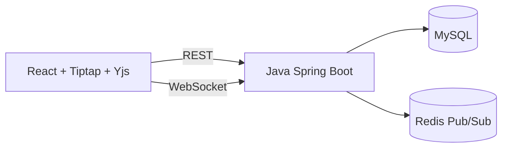
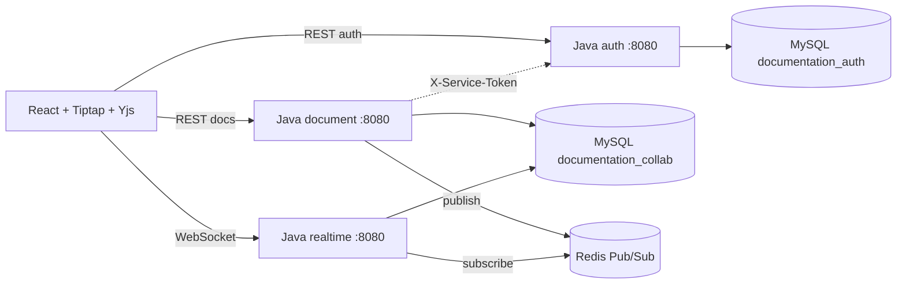

# 架构说明

本说明按当前 Java 后端实现整理。前端通过 REST API 和 WebSocket 连接 Java Spring Boot 后端；Java 后端负责认证授权、协同编辑状态持久化、评论和版本管理，以及 Redis 跨实例广播。

Java 代码库支持按 `APP_SERVICE_ROLE` 环境变量拆分为三个独立服务或合并为一个单体：

- `auth`：用户注册、登录、`/api/me`、内部用户查询接口。
- `document`：文档 CRUD、分享、版本、评论 REST API，通过 Redis 发布事件，本地校验 JWT，不承载 WebSocket。
- `realtime`：WebSocket 协同编辑、Yjs 持久化、Redis 订阅与本地广播。
- `all`（默认）：保留单体模式，三个角色合并在一个进程中。

## 单体部署（默认）

## 微服务拆分部署

- `auth` 服务拥有 `documentation_auth` schema（`users` 表），暴露 `/internal/users/by-email` 和 `/internal/users` 供 document 服务查询。
- `document` 和 `realtime` 服务共享 `documentation_collab` schema（documents、permissions、updates、snapshots、versions、comments 表），collab 表不再包含对 users 表的外键。
- `document` 服务通过 Redis 发布 `comment:*` 和 `document:restored` 事件。
- `realtime` 服务通过 Redis 订阅 `doc:*` 频道，将远端事件广播给本机 WebSocket 连接。

Yjs 是协同富文本状态的事实来源。后端负责用户认证、文档授权、MySQL 持久化 Yjs update，以及通过 Redis 做跨实例实时广播。

为了避免长生命周期文档在打开时回放无限增长的 update 序列，Java 后端支持 Yjs 状态快照。快照保存压缩后的 state update，以及它覆盖的最高持久化序号；`sync:init` 会先发送最新快照，再发送快照之后的增量 updates。

## 认证与边界

Java 后端启动时会从 `JWT_SECRET` 构造 `JwtManager`。密钥为空或等于不安全默认值 `change-this-development-secret` 时拒绝启动。注册和登录由 `AuthController` 处理，密码使用 BCrypt 哈希，JWT 使用 HS256 签名，payload 包含 `sub`、`email` 和 `exp`。REST 请求通过 `Authorization: Bearer <jwt>` 鉴权；CORS 只应用到 `/api/**`，允许来源由 `ALLOWED_ORIGINS` 配置。

WebSocket 路由为 `/ws/documents/{docId}`，Origin 白名单同样来自 `ALLOWED_ORIGINS`。新客户端通过 `Sec-WebSocket-Protocol` 子协议传递 `bearer, <jwt>`；服务端仍兼容旧的 `?token=<jwt>` 查询参数。连接建立时 Java 后端会校验 docId 必须为 UUID、JWT 必须有效，并查询用户在该文档中的角色；失败会返回 `INVALID_DOCUMENT_ID`、`UNAUTHORIZED` 或 `FORBIDDEN` 后关闭连接。

## 高并发协同编辑路径

当前高并发方案面向 Java 后端上的热点协同文档。整体采用兼容式渐进优化：MySQL 仍是最终持久化来源，Redis 仍负责跨实例实时广播，前端仍通过标准 REST 与 WebSocket 消息和 Java 后端交互。

客户端先做写入削峰，再把消息送到后端。本地 Yjs update 会在 35 ms 批量窗口内用 `Y.mergeUpdates` 合并后通过 WebSocket 发送；如果 `socket.bufferedAmount` 超过 1 MiB，关键的 `sync:update` 会保留在本地队列中，并每 50 ms 重试发送。`presence:update` 这类非关键实时消息在发送缓冲过高时直接跳过，避免光标和在线状态挤占编辑 update 的发送能力。远端 Yjs update 仍正常应用，但不会被当成本地写入再次回环发送。

Java 后端为每个 WebSocket 连接维护独立的出站队列和虚拟线程 writer。广播路径只把序列化后的消息放入队列，不再同步写每一个 socket。如果某个客户端无法及时消费队列，后端会记录 `SLOW_CLIENT` 指标并关闭该连接，避免一个慢浏览器阻塞同一文档的其他协作者。已建立连接后的常规写出和慢客户端错误都会收敛到同一条写出路径，避免对同一个 Tomcat WebSocket session 并发写入。

`sync:update` 按文档做短周期批量持久化。同一文档的并发 update 会进入 `UpdateBatcher`，默认达到 32 条或等待 25 ms 后触发一次批量落库；每个等待中的 WebSocket 读循环会等到该 update 持久化结果返回后，再决定是否广播。落库时使用一笔 MySQL 事务追加整批 update，并分配连续 seq；只有持久化成功后才会广播。`document_sequences` 表按文档记录下一个 seq，写入路径不再每次扫描 `MAX(seq)`。文档 `updated_at` 的刷新也按 5 秒窗口限频，减少热点文档上的写放大。

快照提交由服务端治理。编辑者仍可以发送 `sync:snapshot`，但后端只接受基于最新持久化序列、且确实压缩了足够多增量 update 的快照。当前规则是 `snapshotSeq == 当前快照序号 + 当前未压缩增量数`，并且未压缩增量数不少于 `WS_SNAPSHOT_MIN_UPDATES`，默认 100。这样可以避免大量活跃编辑者在高频编辑时反复提交过期或低收益快照。

这套方案优化的是“多人在线、少数人持续编辑”的常见协作场景，而不是让单文档无限扩展。每条 update 或 presence 消息仍会扇出给该文档的活跃连接。因此“所有连接每秒都发送 `presence:update`”的合成压测会比真实编辑流量更重，消息投递量接近 `clients * clients`。

产品化协同能力构建在 REST、WebSocket 和 SQL 契约之上：

- 文档列表支持标题搜索，以及 `active` / `deleted` 状态筛选。
- 软删除文档仍可由 owner 恢复。
- 版本保存记录服务端已持久化的 Yjs update 序列。恢复版本会替换当前持久化序列；在线客户端应重新打开文档以加载恢复后的状态。
- 评论通过 REST API 写入 MySQL。WebSocket 评论事件只是轻量通知，不是评论数据的事实来源。
- 文件格式支持在前端边界处理。Markdown、HTML 和 TXT 导入会先清洗并预览，确认后再创建新文档，并转换为编辑器内容进入 Yjs 持久化流程。前端文档模板复用同一初始化路径。HTML、Markdown、TXT 和 PDF 导出都基于当前编辑器内容生成，其中 HTML / PDF 样式模板在客户端应用。
