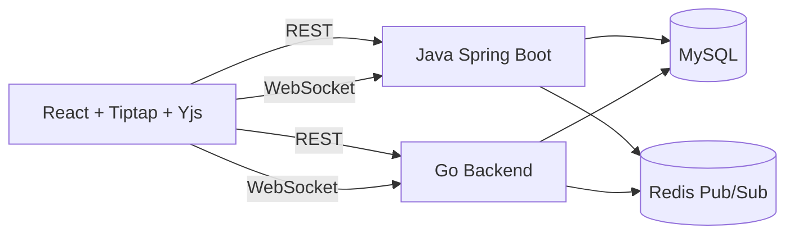

# Architecture

The frontend is backend-agnostic. It talks to either backend through the same REST API and WebSocket message contract.

Yjs is the source of truth for collaborative rich-text state. Backends authenticate users, authorize documents, persist Yjs updates in MySQL, and fan out updates through Redis.
