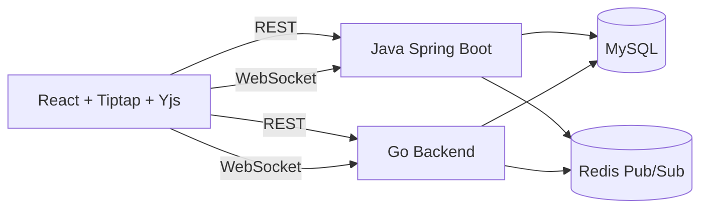

# Architecture

The frontend is backend-agnostic. It talks to either backend through the same REST API and WebSocket message contract.

Yjs is the source of truth for collaborative rich-text state. Backends authenticate users, authorize documents, persist Yjs updates in MySQL, and fan out updates through Redis.

Productized collaboration features build on the same contract:

- Document lists support title search and active/deleted filtering.
- Soft-deleted documents remain recoverable by owners.
- Versions store the server-persisted Yjs update sequence at save time. Restoring a version replaces the persisted sequence; active clients should reopen the document to load the restored state.
- Comments are stored in MySQL through REST APIs. WebSocket comment events are lightweight invalidation hints rather than the source of truth.
- File format support is handled at the frontend boundary. Markdown, HTML, and TXT imports are converted into editor content before Yjs persistence; HTML, Markdown, TXT, and PDF exports are generated from the current editor content.
