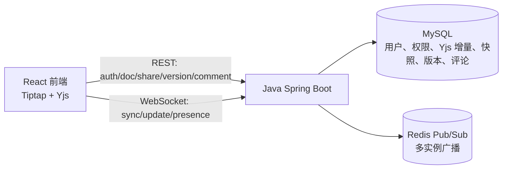
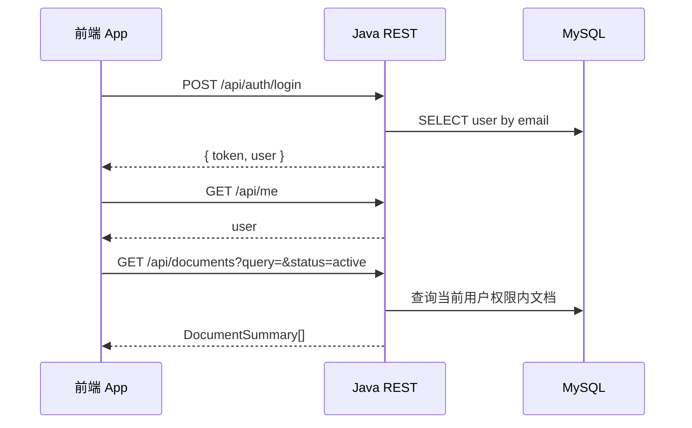
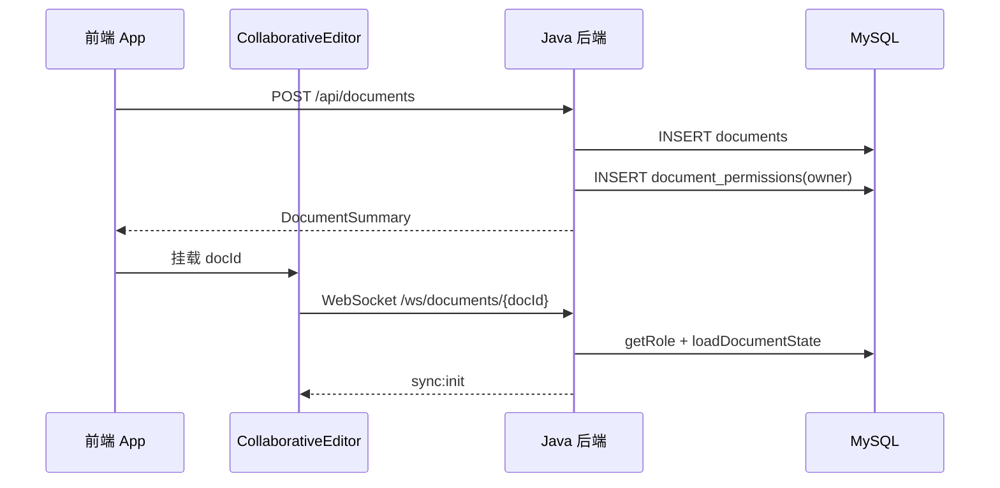
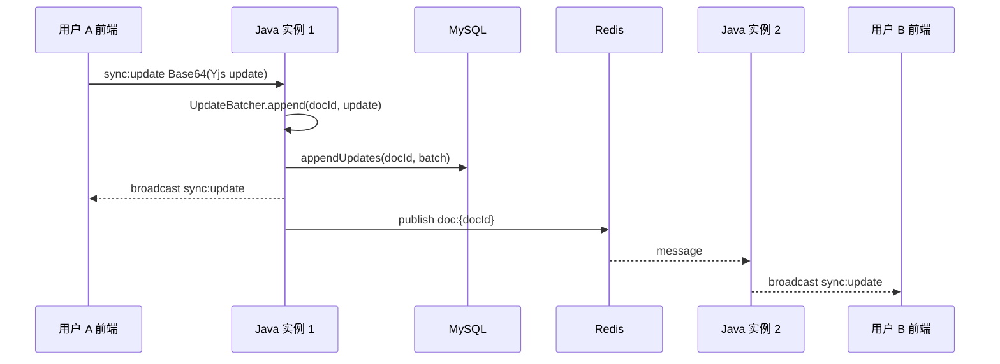

# 前端与 Java 后端实现详解

本文说明在线文档协同编辑系统中 `apps/web` 前端和 `apps/backend-java` Java 后端的主要职责、代码结构、数据链路和维护边界。内容基于当前工作区代码整理，重点服务于后续阅读、联调、排障和继续开发。

## 1. 总体定位

本仓库是一套在线文档协同编辑系统。本文只说明当前前端连接 Java Spring Boot 后端时的实现细节；认证、权限、WebSocket 同步、压测和并发说明均以 `apps/backend-java` 当前代码为准。

核心事实来源：

- REST 契约：`packages/shared-contract/openapi.yml`
- WebSocket 契约：`packages/shared-contract/websocket.md`
- MySQL schema：`packages/shared-contract/sql/schema.mysql.sql`
- 总体架构说明：`docs/architecture.md`
- 运维接口说明：`docs/operability.md`
- 安全默认值说明：`docs/security-notes.md`

端到端架构可以理解为：



关键约束：

- 前端通过 `VITE_API_BASE_URL` 和 `VITE_WS_BASE_URL` 指向 Java 后端，不在业务代码里写死本机地址。
- 后端不理解 Markdown、HTML、TXT 或 PDF 语义，只持久化协同编辑的 Yjs 状态。
- 文档内容的实时状态以 Yjs update 为中心，MySQL 中保存增量、快照和版本。
- 评论通过 REST 落库，WebSocket 评论事件只是活动客户端的刷新提示。

## 2. 前端实现

### 2.1 技术栈与入口

前端位于 `apps/web`，主要技术栈：

- React 19
- TypeScript
- Vite
- Vitest + jsdom
- Tiptap 编辑器
- Yjs 协同状态
- lucide-react 图标
- marked 与 turndown 做 Markdown/HTML 转换

入口文件：

- `apps/web/src/main.tsx`：挂载 React 应用。
- `apps/web/src/App.tsx`：应用主容器，负责认证、文档列表、分享、版本、评论、导入预览和编辑器布局。
- `apps/web/src/CollaborativeEditor.tsx`：协同编辑器，负责 Tiptap、Yjs、WebSocket 同步、在线状态、导出。

### 2.2 后端地址配置

配置代码在 `apps/web/src/config.ts`：

- `API_BASE` 读取 `VITE_API_BASE_URL`，默认 `http://localhost:8080`。
- `WS_BASE` 读取 `VITE_WS_BASE_URL`，未显式设置时从 `API_BASE` 推导。
- 推导规则是 `http` 转 `ws`，`https` 转 `wss`，并清理结尾斜杠。

仓库中已有模式文件：

- `apps/web/.env.java`：连接 Java 后端 `8080`。

本地常用启动方式：

```powershell
npm --prefix apps/web run dev -- --mode java
```

维护注意点：

- 新增环境时优先通过 `.env.local` 或 Vite mode 配置，不要在业务代码里写死部署地址。
- 前端 API 层应按 Java 当前 REST 响应字段维护类型定义。

### 2.3 API 调用层

REST 调用集中在 `apps/web/src/api.ts`。

主要工具函数：

- `joinUrl(base, path)`：拼接基础地址和路径，避免重复斜杠。
- `tokenHeader(token)`：生成 `Authorization: Bearer <token>`。
- `request<T>(path, options)`：统一发起 `fetch`，处理 JSON、204 空响应和错误消息。
- `documentsPath(filters)`：把标题搜索和文档状态过滤转换成 query string。

暴露的 API 方法按业务分组：

- 认证：`register`、`login`、`me`
- 文档：`listDocuments`、`createDocument`、`renameDocument`、`deleteDocument`、`restoreDocument`
- 分享：`listShares`、`shareDocument`、`removeShare`
- 版本：`listVersions`、`createVersion`、`getVersion`、`restoreVersion`
- 评论：`listComments`、`createComment`、`replyToComment`、`updateComment`

错误处理方式：

- 后端非 2xx 时，前端尝试读取响应 JSON 中的 `message`。
- 读取失败时使用 `Request failed with <status>`。
- UI 层最终展示 `Error.message`。

### 2.4 类型模型

前端类型定义在 `apps/web/src/types.ts`，与 REST 契约和 Java `Models.java` 对齐。

主要类型：

- `User`：用户 id、邮箱、展示名、创建时间。
- `DocumentSummary`：文档 id、标题、ownerId、当前用户角色、创建/更新时间、可选 deletedAt。
- `Share`：文档授权用户与角色。
- `DocumentVersionSummary` 与 `DocumentVersion`：版本元数据和 Base64 Yjs updates。
- `CommentThread` 与 `CommentReply`：评论线程和回复。
- `ImportFormat`：`markdown | html | text`。
- `ExportFormat`：`markdown | html | text | pdf`。
- `DocumentStatus`：`active | deleted`。

维护规则：

- 如果 Java 后端新增、删除或改名响应字段，必须同步前端类型、API 调用层和对应文档。

### 2.5 主应用状态与页面布局

`apps/web/src/App.tsx` 是前端的业务编排层。它不直接处理 Yjs update，而是负责用户会话、文档资源和编辑器周边能力。

主要状态：

- `token`：从 `localStorage` 的 `doc-token` 初始化。
- `user`：当前登录用户，由 `/api/me` 校验 token 后填充。
- `documents`：当前筛选条件下的文档列表。
- `selected`：当前选中文档。
- `query` 与 `statusFilter`：标题搜索和有效/回收站过滤。
- `shares`、`versions`、`comments`：选中文档的侧边栏数据。
- `pendingImport`：已创建文档但尚未写入编辑器的初始导入内容。
- `preparedImport`：用户选择文件后的导入预览内容。
- `editorRevision`：版本恢复后强制重建编辑器实例。

权限派生：

- `selectedRole` 来自 `selected.role`。
- `canEdit`：文档未删除，且角色是 `owner` 或 `editor`。
- `canShare`：文档未删除，且角色是 `owner`。
- `isDeleted`：通过 `selected.deletedAt` 判断。

页面区域：

- 未登录时展示认证面板，支持登录和注册。
- 登录后左侧是文档工作区，包含新建、模板、导入、搜索、状态过滤、刷新和文档列表。
- 右侧主区域包含文档头、重命名、编辑器、分享、历史版本和评论面板。
- 回收站文档不加载编辑器，只展示恢复提示。

### 2.6 认证流程

认证流程由 `App.tsx` 编排：

1. 用户提交登录或注册表单。
2. 前端调用 `api.login` 或 `api.register`。
3. 后端返回 `{ token, user }`。
4. 前端把 token 存入 `localStorage`。
5. `token` 状态变化触发 `/api/me` 校验。
6. 校验失败时执行 `logout()`，清理 token、用户、文档和选中项。

该流程的结果是所有后续 REST 请求都通过 `Authorization` 头携带 JWT。

### 2.7 文档列表、新建、模板和导入

文档列表：

- `loadDocuments()` 调用 `api.listDocuments(token, { query, status })`。
- 后端默认只返回有效文档，回收站通过 `status=deleted` 查询。
- 前端再次按 `updatedAt` 倒序排序。
- 如果当前选中文档仍在列表中，保持选中；否则选中第一篇或清空。

普通新建：

- `createDocument()` 调用 `POST /api/documents`。
- 新文档插入列表头部并选中。

模板新建：

- 模板定义在 `apps/web/src/documentTemplates.ts`。
- 当前模板包括空白文档、会议纪要、项目计划和周报。
- `createDocumentFromTemplate()` 先调用后端创建文档，再把模板 HTML 放入 `pendingImport`。
- 真正写入编辑器发生在 `CollaborativeEditor` 收到空文档的 `sync:init` 后。

文件导入：

- 导入转换在 `apps/web/src/documentFormats.ts`。
- 支持 `.md`、`.markdown`、`.html`、`.htm`、`.txt`。
- 用户选择文件后先进入 `prepareImportFile()`，生成可预览的安全 HTML。
- 用户确认后才调用后端创建新文档。
- 导入永远创建新文档，不覆盖现有协同文档。

这样设计的原因：

- 后端保持格式无关。
- 用户可以在导入前确认清洗后的内容。
- 初始内容只有在新文档没有任何持久化 update 时才会写入，避免覆盖协作状态。

### 2.8 导入与导出转换

`apps/web/src/documentFormats.ts` 负责边界转换。

导入：

- Markdown 通过 `marked.parse()` 转 HTML。
- TXT 按空行拆段，转成多个 `<p>`，并做 HTML 转义。
- HTML 通过 `sanitizeImportedHtml()` 清洗。

清洗策略：

- 移除 `script`、`style`、`iframe`、`object`、`embed`。
- 仅允许有限标签，如 `a`、`blockquote`、`code`、`h1` 到 `h6`、`li`、`ol`、`p`、`pre`、`strong`、`ul` 等。
- 非允许标签会被拆掉，但保留子节点文本。
- 只允许链接的 `href` 和 `title`，并拒绝 `javascript:` 与 `data:` 链接。

导出：

- HTML 和 PDF 使用 `apps/web/src/exportStyles.ts` 中的样式模板。
- Markdown 使用 turndown 从 HTML 转换。
- TXT 从清洗后的 HTML 提取文本。
- PDF 是浏览器打印流程，不是后端生成。

导出样式：

- `clean`：适合普通文档和知识库归档。
- `report`：适合正式汇报或 PDF。
- `compact`：减少留白，适合较长文档。

### 2.9 协同编辑器

`apps/web/src/CollaborativeEditor.tsx` 是实时协作核心。

编辑器初始化：

- 每个 `docId` 创建独立 `Y.Doc`。
- Tiptap 使用 `StarterKit`、`Placeholder` 和 `Collaboration`。
- `StarterKit` 禁用内置 undo/redo，避免和协同状态冲突。
- `readOnly` 会同时控制 Tiptap 的 `editable` 状态和本地 update 是否发送。

WebSocket 连接：

```ts
new WebSocket(`${WS_BASE}/ws/documents/${docId}`, ['bearer', token])
```

连接成功后立即发送 presence：

```json
{
  "type": "presence:update",
  "displayName": "用户展示名",
  "color": "#2563eb"
}
```

收到 `sync:init`：

1. 如果消息含 `snapshot`，先应用快照。
2. 再按顺序应用 `updates`。
3. 如果当前用户可编辑且增量数达到阈值，提交 `sync:snapshot`。
4. 如果存在匹配当前文档的 `initialImport`，且服务端没有任何已持久化内容，则把导入 HTML 写入编辑器。

本地编辑：

- 监听 `ydoc.on('update')`。
- `origin === 'remote'` 时不回发。
- socket 未连接或只读时不发送。
- 其他本地更新先进入本地批量队列，35 ms 窗口内用 `Y.mergeUpdates` 合并，再编码为 Base64 后发送 `sync:update`。
- 如果 WebSocket 发送缓冲超过 1 MiB，关键 `sync:update` 保留在本地队列中，并每 50 ms 重试；非关键实时消息会跳过发送。

远端消息：

- `sync:update`：把 Base64 update 应用到本地 Y.Doc，origin 标记为 `remote`。
- `presence:update`：更新在线用户最近活跃时间。
- `document:restored`：刷新页面，确保版本恢复后重新加载服务端状态。
- `error`：对 `UNAUTHORIZED`、`FORBIDDEN`、`INVALID_DOCUMENT_ID` 不重连，其他错误可进入重连。

重连策略：

- 指数退避，最大延迟 10 秒。
- 最多尝试 12 次。
- 认证、授权和非法文档 id 错误不会继续重连。

在线状态：

- `online` 以展示名为 key，记录最近收到 presence 的时间。
- 每 5 秒清理 30 秒未更新的在线用户。

### 2.10 分享、版本和评论面板

分享：

- 只有 owner 能看到分享面板。
- 可授予 `editor` 或 `viewer`。
- owner 授权不能通过 UI 移除。
- 调用路径为 `/api/documents/{docId}/shares`。

版本：

- 任意有文档访问权限的用户可列出版本。
- 前端允许保存版本，后端会记录当前持久化的 Yjs 状态。
- 只有 owner/editor 能恢复版本。
- 恢复版本后前端递增 `editorRevision` 并刷新文档列表，编辑器 key 改变后重新挂载。

评论：

- 有文档访问权限的用户可以创建评论。
- owner/editor 可以切换 resolved 状态。
- 当前 UI 展示评论和 resolved 状态，未实现回复输入界面，但 API 层已有 `replyToComment`。
- 评论 mutation 后前端主动重新拉取列表；后端也会广播 WebSocket 提示，客户端必须允许未知事件以便协议前向兼容。

### 2.11 样式与响应式

样式集中在 `apps/web/src/styles.css`。

布局特点：

- 桌面端使用左侧 320px 文档栏和右侧编辑工作区。
- 工作区内编辑器和侧边栏并列。
- `max-width: 960px` 时改为单列布局。
- `max-width: 640px` 时减少页面和编辑器内边距。

交互细节：

- 表单、按钮和编辑器使用统一 focus outline。
- icon button 使用 lucide-react 图标。
- 回收站文档、空状态、导入预览都有独立视觉状态。

## 3. Java 后端实现

### 3.1 技术栈与模块结构

Java 后端位于 `apps/backend-java`，主要技术栈：

- Java 21
- Spring Boot 3.5
- Spring Web
- Spring WebSocket
- Spring JDBC
- Spring Security Crypto 的 BCrypt
- MySQL Connector/J
- Jedis Redis 客户端
- JUnit 5、AssertJ、Mockito

主要源码文件：

- `Application.java`：启动类、Bean、CORS、Redis 和 JWT 配置。
- `AuthController.java`：注册、登录、当前用户。
- `DocumentController.java`：文档、分享、版本、评论 REST API。
- `DocumentSocketHandler.java`：WebSocket 协同同步。
- `AuthRepository.java`、`DocumentRepository.java`、`RealtimeRepository.java`：按 auth、document、realtime 角色拆分 MySQL 读写；`AppRepository.java` 保留给 `all` 单体兼容路径。
- `Models.java`：REST、WebSocket 和仓储返回模型。
- `Roles.java`：角色能力判断。
- `JwtManager.java`：HS256 JWT 签发与校验。
- `RedisBus.java`：Redis Pub/Sub 跨实例广播。
- `ServiceRole.java`、`ConditionalOnRole.java`：根据 `APP_SERVICE_ROLE` 控制 Bean 和接口是否启用。
- `AuthInternalClient.java`、`AuthInternalController.java`：document 服务和 auth 服务之间的内部用户查询。
- `ErrorAdvice.java`：REST 错误格式。
- `HealthController.java`：`/healthz` 和 `/readyz`。
- `MetricsController.java`、`MetricsFilter.java`、`MetricsRegistry.java`：Prometheus 指标。
- `WebSocketConfig.java`：WebSocket 路由和 Origin 白名单。

### 3.2 启动配置

配置文件在 `apps/backend-java/src/main/resources/application.yml`。

关键配置：

- `JAVA_HTTP_PORT`：服务端口，默认 `8080`。
- `MYSQL_HOST`、`MYSQL_PORT`、`MYSQL_DATABASE`、`MYSQL_USER`、`MYSQL_PASSWORD`：MySQL 连接。
- `JWT_SECRET`：JWT 签名密钥，必须显式设置；为空或等于 `change-this-development-secret` 时 Java 应用拒绝启动。
- `JWT_TTL`：JWT 有效期，默认 `2h`。
- `BCRYPT_COST`：密码哈希成本，默认 `12`。
- `APP_SERVICE_ROLE`：Java 服务角色，取值为 `auth`、`document`、`realtime` 或 `all`。
- `SERVICE_TOKEN`：服务间内部接口共享密钥；auth 角色启动时必须配置，document 调用 auth 内部接口时必须携带。
- `AUTH_BASE_URL`：document 服务访问 auth 内部接口的基地址，split Compose 默认 `http://backend-java-auth:8080`。
- `REDIS_HOST`、`REDIS_PORT`、`REDIS_PASSWORD`、`REDIS_TLS`：Redis 连接。
- `ALLOWED_ORIGINS`：REST CORS 和 WebSocket Origin 白名单。
- `DB_MAX_OPEN_CONNS`、`DB_MAX_IDLE_CONNS`：Hikari 连接池大小。
- `WS_SEND_QUEUE_SIZE`、`WS_BATCH_MAX_SIZE`、`WS_BATCH_FLUSH_MS`、`WS_SNAPSHOT_MIN_UPDATES`：WebSocket 出站队列、批量落库和快照阈值。

`Application.java` 中创建的 Bean：

- `BCryptPasswordEncoder`：按 `BCRYPT_COST` 构造。
- `JwtManager`：校验 `JWT_SECRET` 后构造。
- `JedisPooled`：支持 Redis 密码和 TLS。
- `WebMvcConfigurer`：只对 `/api/**` 配置 CORS，允许 `GET`、`POST`、`PATCH`、`DELETE`、`OPTIONS`。
- `WebSocketConfig`：把 `DocumentSocketHandler` 注册到 `/ws/documents/{docId}`，并使用同一组 `ALLOWED_ORIGINS` 做 Origin 白名单。

### 3.3 数据库表设计

schema 位于 `packages/shared-contract/sql/schema.mysql.sql`。

表职责：

- `users`：用户账号、密码哈希、展示名。
- `documents`：文档元数据，包含 owner、标题、创建/更新时间和软删除时间。
- `document_permissions`：文档授权表，角色为 `owner`、`editor`、`viewer`。
- `document_updates`：Yjs 增量更新，按 `document_id + seq` 唯一排序。
- `document_snapshots`：Yjs 快照，记录 `last_seq` 和压缩后的状态。
- `document_versions`：手动保存的历史版本，存储版本创建时的 Base64 update 序列。
- `document_comments`：评论线程。
- `document_comment_replies`：评论回复。

Java 后端所有持久化入口都在 `AppRepository.java`，业务层不直接拼 SQL。

### 3.4 REST 模型

`Models.java` 使用 Java record 定义请求、响应和内部模型。

重点模型：

- `User`、`UserClaims`
- `DocumentView`
- `ShareView`
- `AuthResponse`
- `DocumentVersionSummary`、`DocumentVersion`
- `DocumentState`
- `CommentThread`、`CommentReply`
- `ApiError`
- `WsMessage`
- `RedisEnvelope`

注意：

- record 字段名会直接影响 JSON 字段名。
- 与前端 `types.ts` 和文档中的 REST 说明保持一致。

### 3.5 认证与授权

认证入口在 `AuthController.java`。

注册：

1. 校验 `email`、`password`、`displayName` 非空。
2. 使用 BCrypt 哈希密码。
3. `AppRepository.createUser()` 写入 `users`。
4. 返回 JWT 和用户信息。
5. 邮箱重复由 `DuplicateKeyException` 转为 `USER_EXISTS`。

登录：

1. 根据邮箱查询用户和密码哈希。
2. 邮箱不存在和密码错误统一返回 `UNAUTHORIZED`，避免暴露账号是否存在。
3. BCrypt 校验通过后签发 JWT。

当前用户：

- `GET /api/me` 要求 `Authorization: Bearer <jwt>`。
- `claims()` 统一解析 Bearer token。

JWT：

- `JwtManager` 手写 HS256 JWT。
- payload 包含 `sub`、`email`、`exp`。
- 校验签名和过期时间。
- token 格式不合法、签名不匹配或已过期时，REST 统一转为 `UNAUTHORIZED`。

角色能力：

- `owner`：可读、可写、可分享、可删除、可恢复。
- `editor`：可读、可写、可重命名、可保存/恢复版本、可更新评论状态。
- `viewer`：可读、可接收实时更新，不可发送编辑 update。

角色判断集中在 `Roles.java`：

- `canEdit(role)`：owner 或 editor。
- `canShare(role)`：owner。
- `valid(role)`：owner、editor、viewer。

### 3.6 文档 REST API

文档 REST API 在 `DocumentController.java`。

文档列表：

- `GET /api/documents`
- 参数：`query`、`status`
- `status` 只接受 active/deleted 语义，其他值按 active 处理。
- SQL 会根据当前用户权限表过滤，只返回用户有访问权的文档。

创建文档：

- `POST /api/documents`
- 标题为空时使用 `Untitled document`。
- 仓储层创建 `documents` 记录，并在 `document_permissions` 写入 owner 权限。

获取文档：

- `GET /api/documents/{docId}`
- 只能访问未删除文档。

重命名：

- `PATCH /api/documents/{docId}`
- 需要 owner 或 editor。
- 仓储 SQL 会再次约束角色和未删除状态。

软删除：

- `DELETE /api/documents/{docId}`
- 只允许 owner。
- 实际写入 `documents.deleted_at`，不删除内容、权限、评论或版本。

恢复：

- `POST /api/documents/{docId}/restore`
- 只允许 owner。
- 清空 `deleted_at` 并更新时间。

### 3.7 分享 REST API

分享接口：

- `GET /api/documents/{docId}/shares`
- `POST /api/documents/{docId}/shares`
- `DELETE /api/documents/{docId}/shares/{userId}`

权限：

- 只有 owner 可以管理分享。
- 新增分享只允许 `editor` 或 `viewer`，不允许通过接口授予 owner。
- 删除分享时 SQL 明确 `role <> 'owner'`，避免移除 owner。

落库方式：

- 根据邮箱查找用户 id。
- 使用 `INSERT ... ON DUPLICATE KEY UPDATE` 新增或更新角色。
- 用户不存在返回 `USER_NOT_FOUND`。

### 3.8 版本 REST API

版本接口：

- `GET /api/documents/{docId}/versions`
- `POST /api/documents/{docId}/versions`
- `GET /api/documents/{docId}/versions/{versionId}`
- `POST /api/documents/{docId}/versions/{versionId}/restore`

保存版本：

1. `AppRepository.createVersion()` 读取当前 `DocumentState`。
2. 如果存在快照，先把快照作为版本第一段 update。
3. 追加快照之后的增量 updates。
4. 每段 update 转 Base64。
5. 用换行拼接后写入 `document_versions.state_data`。
6. label 为空时使用 `Manual version`。

恢复版本：

1. 读取版本中的 Base64 update 列表。
2. 开事务并锁定文档。
3. 删除当前 `document_updates` 和 `document_snapshots`。
4. 按顺序把版本 update 重新写入 `document_updates`，seq 从 1 开始。
5. 更新时间。
6. `DocumentController` 广播 `document:restored`，让活动客户端重新加载。

维护注意点：

- 版本恢复会替换持久化状态，不合并当前活动客户端内存状态。
- 前端收到 `document:restored` 后刷新页面是必要行为。

### 3.9 评论 REST API

评论接口：

- `GET /api/documents/{docId}/comments`
- `POST /api/documents/{docId}/comments`
- `POST /api/documents/{docId}/comments/{commentId}/replies`
- `PATCH /api/documents/{docId}/comments/{commentId}`

权限：

- 有文档访问权限即可列出、创建评论和回复。
- 只有 owner/editor 可以更新评论正文或 resolved 状态。

落库：

- 评论写入 `document_comments`。
- 回复写入 `document_comment_replies`。
- 列表查询会先查评论，再批量查询回复并组装到 `CommentThread.replies`。

WebSocket 提示：

- 创建评论广播 `comment:created`。
- 回复评论广播 `comment:updated`。
- 更新 resolved 时广播 `comment:resolved`。
- 这些事件不是评论数据源，客户端需要通过 REST 重新拉取以保证一致。

### 3.10 WebSocket 协同同步

WebSocket 路由由 `WebSocketConfig.java` 注册：

```text
/ws/documents/{docId}
```

连接认证：

- 新客户端通过 WebSocket 子协议传递 token：`["bearer", "<jwt>"]`。
- 服务端仍兼容旧的 `?token=<jwt>`。
- `DocumentSocketHandler.getSubProtocols()` 声明支持 `bearer`。
- docId 必须是 UUID 格式，否则返回 `INVALID_DOCUMENT_ID` 并关闭连接。
- token 无效返回 `UNAUTHORIZED`。
- 当前用户没有文档权限返回 `FORBIDDEN`。

连接建立后的初始化：

1. 从 URL 提取 docId。
2. 校验 JWT。
3. 查询用户在文档中的角色。
4. 读取 `DocumentState`。
5. 把快照和增量转 Base64。
6. 当前 session 加入 `sessions[docId]`。
7. 发送 `sync:init`：

```json
{
  "type": "sync:init",
  "docId": "uuid",
  "snapshot": "base64-yjs-state-update",
  "snapshotSeq": 120,
  "updates": ["base64-yjs-update"]
}
```

处理 `sync:update`：

- 只有 owner/editor 可发送。
- update 是 Base64 编码。
- 解码后大小不能超过 `MAX_UPDATE_BYTES`，当前为 1 MB。
- 调用 `UpdateBatcher.append()` 进入按文档聚合队列；默认达到 32 条或等待 25 ms 后调用 `AppRepository.appendUpdates()` 批量持久化。
- `append()` 返回的 future 完成后才广播；持久化失败返回 `DATABASE_ERROR`，不会广播。
- 广播给本实例同文档 session，并通过 Redis 发布到 `doc:<docId>`。

处理 `presence:update`：

- 服务端补充 `docId` 和 `userId`。
- 不落库，只广播。

处理 `sync:snapshot`：

- 只有 owner/editor 可发送。
- snapshot 同样限制 1 MB。
- `snapshotSeq` 必须为正数。
- `snapshotSeq` 必须等于当前快照序号加当前未压缩增量数，并且未压缩增量数达到后端阈值，默认 100。
- `AppRepository.saveSnapshot()` 保存快照，并删除 `seq <= snapshotSeq` 的旧增量。

错误消息：

```json
{
  "type": "error",
  "code": "FORBIDDEN",
  "message": "You cannot edit this document."
}
```

### 3.11 Yjs 增量、快照和锁

文档内容状态由 `AppRepository` 中几组方法维护：

- `appendUpdates(docId, updates)`：当前 `UpdateBatcher` 使用的批量追加入口。
- `appendUpdate(docId, update)`：单条追加包装方法，内部调用 `appendUpdates()`。
- `loadDocumentState(docId)`
- `saveSnapshot(docId, lastSeq, snapshot)`

追加 update：

1. `lockDocument(docId)` 使用 `SELECT ... FOR UPDATE` 锁定文档行。
2. 确保 `document_sequences` 中存在该文档的序号记录。首次写入时，初始值取 `document_updates` 最大 seq 和 `document_snapshots` 最大 last_seq 的较大值再加 1。
3. `SELECT next_seq FROM document_sequences ... FOR UPDATE` 锁定序号行，得到本批次起始 seq。
4. 批量插入 `document_updates`，为本批次分配连续 seq。
5. 将 `document_sequences.next_seq` 推进本批次大小。
6. 按 5 秒窗口刷新 `documents.updated_at`，减少热点文档写放大。

读取状态：

1. 查最新快照，拿到 `snapshot_data` 和 `last_seq`。
2. 查 `seq > snapshotSeq` 的增量。
3. 返回 `DocumentState(snapshot, snapshotSeq, updates)`。

保存快照：

1. 校验 `lastSeq > 0`。
2. 锁定文档。
3. 插入或覆盖同一 `document_id + last_seq` 的快照。
4. 删除 `seq <= lastSeq` 的旧增量。

这样可以避免长文档每次连接都回放完整增量序列。

### 3.12 Redis 跨实例广播

`RedisBus.java` 负责跨实例消息传播。

设计：

- 每个 Java 进程启动时生成一个 `source` UUID。
- 构造器中启动虚拟线程订阅 `doc:*`。
- 本实例广播时发布到 `doc:<docId>`。
- Redis 消息包含 `source`、`docId`、`body`。
- 收到 Redis 消息时忽略自己发出的消息，避免回环。

当前广播内容包括：

- `sync:update`
- `presence:update`
- `comment:*`
- `document:restored`

失败策略：

- Redis 发布或订阅失败只记录 warning，不直接中断 REST 或 WebSocket 主流程。
- 这意味着单实例本地广播仍然可用，但多实例同步会受影响。

### 3.13 WebSocket 出站队列和慢客户端

`OutboundWebSocketClient.java` 为每个已建立连接维护一个 `ArrayBlockingQueue<TextMessage>`，队列大小由 `WS_SEND_QUEUE_SIZE` 控制，默认 32。

写出策略：

- `DocumentSocketHandler.broadcastLocal()` 只负责把序列化后的消息 `enqueue()` 到每个连接的队列。
- 每个连接启动一个虚拟线程 writer，从队列中 `take()` 消息并调用 `session.sendMessage()`。
- `send()` 使用 `writeLock` 串行化同一 `WebSocketSession` 的写出，避免 Tomcat WebSocket session 并发写入。

慢客户端策略：

- 队列满时 `enqueue()` 返回失败，并调用 `closeSlowClient()`。
- 后端记录 `documentation_collab_ws_errors_total{code="SLOW_CLIENT"}` 和 `documentation_collab_ws_slow_clients_total`。
- 后端尽量发送 `SLOW_CLIENT` 错误消息，然后用 `CloseStatus.SESSION_NOT_RELIABLE` 关闭连接。

### 3.14 错误格式

REST 错误由 `ErrorAdvice.java` 统一返回 `ApiError`：

```json
{
  "code": "UNAUTHORIZED",
  "message": "Missing bearer token."
}
```

主要映射：

- `UnauthorizedException`：HTTP 401，`UNAUTHORIZED`
- `ForbiddenException`：HTTP 403，`FORBIDDEN`
- `BadRequestException`：HTTP 400，`VALIDATION_ERROR`
- `UserNotFoundException`：HTTP 404，`USER_NOT_FOUND`
- `EmptyResultDataAccessException`：HTTP 404，`NOT_FOUND`

注意：

- WebSocket 错误不走 `ErrorAdvice`，而是在 socket 内发送 `type=error` 消息。
- 前端 `api.ts` 目前主要展示 `message`，不会根据 `code` 做复杂分支。

### 3.15 健康检查与指标

健康检查：

- `GET /healthz`：只证明进程存活，返回 `{ "status": "ok" }`。
- `GET /readyz`：调用 `repository.ping()` 查询 MySQL，失败返回 HTTP 503。
- `/readyz` 成功返回 `{ "status": "ready" }`，失败返回 `{ "status": "not_ready" }`。

指标：

- `GET /metrics` 返回 Prometheus 文本格式。
- `MetricsFilter` 记录除 `/metrics` 外的 HTTP 请求。
- `DocumentSocketHandler` 记录 WebSocket 连接、断开和消息类型。

指标名：

- `documentation_collab_http_requests_total{method,path,status}`
- `documentation_collab_ws_connections_total`
- `documentation_collab_ws_connections_active`
- `documentation_collab_ws_messages_total{type}`
- `documentation_collab_ws_errors_total{code}`
- `documentation_collab_ws_message_bytes_total`
- `documentation_collab_ws_slow_clients_total`
- `documentation_collab_ws_send_queue_depth_max`
- `documentation_collab_ws_broadcast_duration_ms_count|sum|max`
- `documentation_collab_ws_persist_duration_ms_count|sum|max`
- `documentation_collab_ws_batch_size_count|sum|max`

`MetricsRegistry.normalizePath()` 会把路径中的 UUID 替换为 `{docId}`，减少指标基数。

## 4. 压测和并发验证

WebSocket 压测工具位于 `apps/backend-go/cmd/ws-loadtest`，但可直接压测 Java 后端地址。常用命令：

```powershell
npm run loadtest:ws -- -url ws://localhost:18080/ws/documents -doc-id <uuid> -token <jwt> -clients 100 -duration 30s -interval 1s -mode presence
npm run loadtest:ws -- -url ws://localhost:18080/ws/documents -doc-id <uuid> -token <jwt> -clients 100 -duration 30s -interval 1s -mode update
```

压测结果重点看：

- `connected` 是否等于 `clients`。
- `errors`、`disconnects`、`error_codes` 是否出现异常。
- `receive_latency_p95` 是否随着客户端数上升明显恶化。
- Java `/metrics` 中 `documentation_collab_ws_send_queue_depth_max` 是否接近 `WS_SEND_QUEUE_SIZE`。
- `documentation_collab_ws_slow_clients_total` 是否增加。
- `documentation_collab_ws_batch_size_count|sum|max` 是否符合 update 模式下的批量落库预期。

`presence` 模式主要压广播扇出和出站队列；`update` 模式会走完整的权限校验、Yjs update 大小校验、`UpdateBatcher`、MySQL 批量落库和广播路径。

## 5. 端到端业务链路

### 5.1 登录到加载文档



### 5.2 创建文档并开始协同编辑



### 5.3 导入文件到新文档

1. 前端读取本地文件。
2. 根据扩展名判断 Markdown、HTML 或 TXT。
3. 转换并清洗为安全 HTML。
4. 展示导入预览。
5. 用户确认后创建新文档。
6. `pendingImport` 传给 `CollaborativeEditor`。
7. 编辑器收到空文档 `sync:init` 后执行 `editor.commands.setContent(html)`。
8. Tiptap/Yjs 产生本地 update。
9. 前端通过 WebSocket 发送 `sync:update`。
10. Java 后端通过 `UpdateBatcher` 批量写入 `document_updates`。

### 5.4 实时编辑与广播



### 5.5 保存与恢复版本

保存版本：

1. 前端调用 `POST /api/documents/{docId}/versions`。
2. Java 读取当前快照和增量。
3. 转成 Base64 update 列表并写入 `document_versions`。

恢复版本：

1. 前端调用 `POST /api/documents/{docId}/versions/{versionId}/restore`。
2. Java 删除当前 updates 和 snapshots。
3. 把版本中的 update 序列重新写入 updates。
4. Java 广播 `document:restored`。
5. 活动前端刷新页面并重新打开文档。

### 5.6 评论写入与通知

1. 前端通过 REST 创建或更新评论。
2. Java 写入 MySQL。
3. Java 广播 `comment:*` WebSocket 事件。
4. 前端当前实现会在 REST mutation 后主动重新拉取评论列表。
5. 后续如果要实时刷新其他客户端，可在收到 `comment:*` 时调用 `api.listComments`。

## 6. 测试覆盖

前端测试：

- `api.test.ts`：URL 拼接、Bearer header、文档筛选参数、版本创建请求。
- `config.test.ts`：从 API 地址推导 WebSocket 地址。
- `documentFormats.test.ts`：导入格式识别、Markdown/HTML/TXT 转换、HTML 清洗、导出转换、初始导入判断。
- `documentTemplates.test.ts`：模板存在性和安全 HTML。
- `exportStyles.test.ts`：导出样式和 HTML 包装。
- `CollaborativeEditor.test.ts`：WebSocket 错误重连策略、快照应用顺序、快照提交阈值。

Java 测试：

- `AuthControllerTest`：无效 Bearer token、登录错误信息一致性。
- `JwtManagerTest`：JWT 签发、校验和篡改拒绝。
- `RolesTest`：角色能力判断。
- `DocumentSocketHandlerTest`：无效 token、无效 docId、超大 update、snapshot 消息。
- `MetricsRegistryTest`：Prometheus 指标输出。
- `HealthControllerTest`：健康检查返回。

常用验证命令：

```powershell
npm run test:web
npm run build:web
npm run test:java
```

## 7. 维护边界与变更建议

修改前端时：

- REST 字段先看 `openapi.yml` 和 `types.ts` 是否一致。
- WebSocket 消息先看 `websocket.md` 和 `CollaborativeEditor.tsx` 是否一致。
- 不要在 UI 中判断 Java 专属错误或响应结构。
- 导入导出属于前端边界，不要要求 Java 后端识别文件格式。

修改 Java 后端时：

- 权限、角色、错误码、REST 字段、WebSocket 消息变更必须同步 Java 文档和前端类型。
- `Models.java` 的 record 字段名就是 JSON 字段名，改名会影响前端。
- `AppRepository` 中涉及 schema 的 SQL 变更必须同步 `schema.mysql.sql`。
- WebSocket 写路径要继续保护 viewer 只读语义。
- Yjs update 和 snapshot 都必须保持 Base64 文本协议，二进制只在服务端和数据库内部存在。

修改协同同步时：

- `sync:init` 必须先 snapshot 后 updates。
- 前端发送本地 update 时必须避免把 remote update 回发。
- 版本恢复后不能让旧本地状态继续写入，需要重新加载。
- Redis 事件需要带 source，避免同实例回环。

修改评论时：

- REST 是评论真实数据源。
- WebSocket 评论事件只能作为刷新提示。
- 客户端必须忽略未知事件类型。

修改运维接口时：

- `/healthz`、`/readyz`、`/metrics` 的说明必须和 Java 控制器、过滤器、指标注册表保持一致。
- 指标路径要注意基数，动态 UUID 应归一化。

## 8. 快速定位表

| 需求 | 前端入口 | Java 后端入口 | 契约 |
| --- | --- | --- | --- |
| 登录/注册 | `apps/web/src/App.tsx`、`apps/web/src/api.ts` | `AuthController.java`、`JwtManager.java` | `openapi.yml` |
| 文档列表/新建/重命名 | `App.tsx`、`api.ts` | `DocumentController.java`、`AppRepository.java` | `openapi.yml`、`schema.mysql.sql` |
| 回收站 | `App.tsx` | `DocumentController.java`、`AppRepository.java` | `openapi.yml`、`schema.mysql.sql` |
| 分享权限 | `App.tsx`、`types.ts` | `DocumentController.java`、`Roles.java`、`AppRepository.java` | `openapi.yml` |
| 协同编辑 | `CollaborativeEditor.tsx` | `DocumentSocketHandler.java`、`AppRepository.java` | `websocket.md`、`schema.mysql.sql` |
| 快照压缩 | `CollaborativeEditor.tsx` | `DocumentSocketHandler.java`、`AppRepository.java` | `websocket.md`、`schema.mysql.sql` |
| 历史版本 | `App.tsx`、`api.ts` | `DocumentController.java`、`AppRepository.java` | `openapi.yml`、`schema.mysql.sql` |
| 评论 | `App.tsx`、`api.ts` | `DocumentController.java`、`AppRepository.java`、`DocumentSocketHandler.java` | `openapi.yml`、`websocket.md` |
| 导入导出 | `documentFormats.ts`、`exportStyles.ts`、`CollaborativeEditor.tsx` | 后端不处理格式 | `docs/api-contract.md` |
| 健康检查/指标 | 无直接 UI | `HealthController.java`、`MetricsController.java` | `openapi.yml`、`docs/operability.md` |

